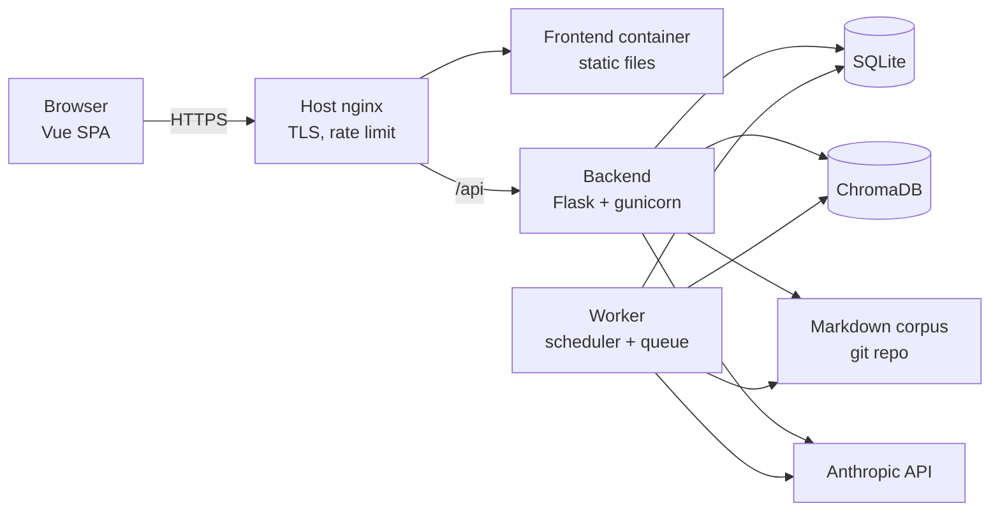
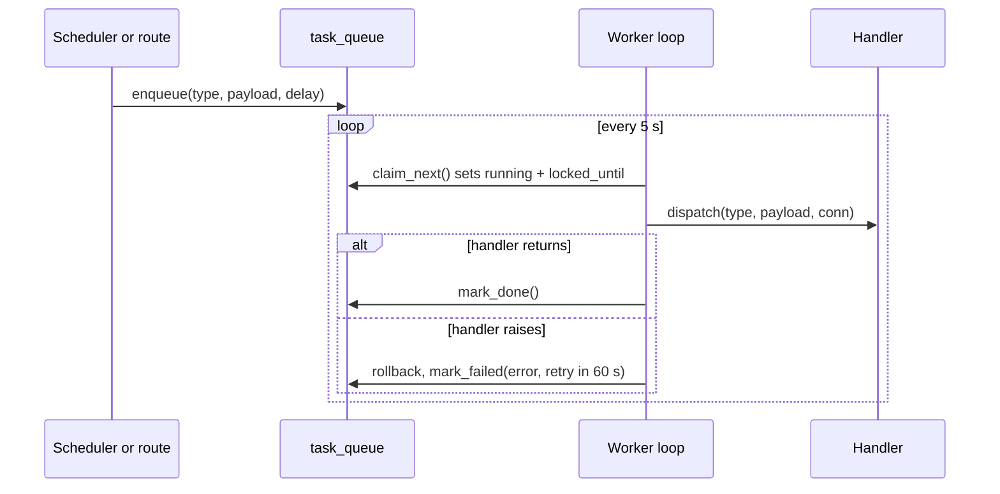
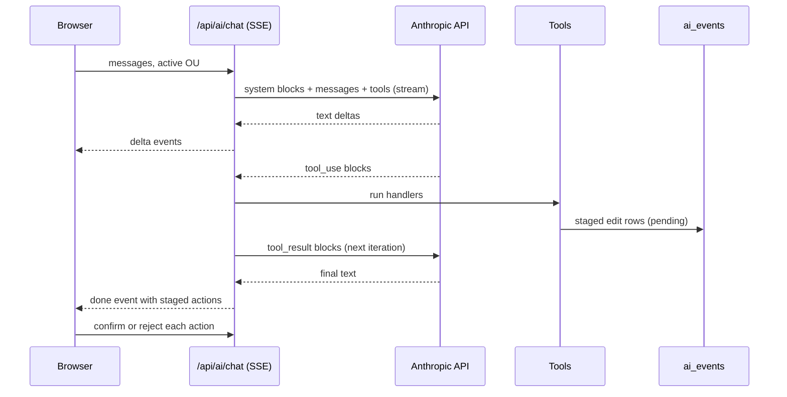
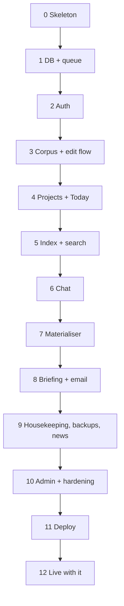

# SLEEPY Build Guide

> Written 2026-09-18 by KL Mithunvel (with Claude) for someone building their own
> SLEEPY-style assistant from scratch. This is a snapshot exported from the living
> copy at https://claude.ai/code/artifact/260405f8-ed9a-4800-95ff-4f6891d62689 — edit
> there, re-export here. It describes the design and the build order, not this
> repo's exact code; for that, read `.claude/CLAUDE.md`, `docs/CORPUS_SCHEMA.md` and
> `docs/SETUP.md` alongside it.

How the SLEEPY personal project-management assistant is built, and a step-by-step order for building your own.

## What SLEEPY is

SLEEPY is a self-hosted, single-user project-management assistant: a folder of Markdown files under git is the only source of truth, and an LLM reads it, writes a morning briefing, answers questions, and proposes edits that the user confirms before they are committed. It runs as a small Flask API, a Vue single-page app, a background worker, and a vector store, on one cheap VPS.

It was built for one person with three life domains (personal, college, company). Nothing in it is multi-tenant. Your own copy should stay single-user too; that is what keeps the security model simple.

Four principles decide almost every later choice. Keep them in front of you while building.

1. **Markdown plus git is the truth.** SQLite and the vector index are derived and can be deleted and rebuilt at any time. If a feature needs state that cannot be rebuilt from the Markdown, it is probably designed wrong.
2. **The AI never writes a file directly.** Every change goes through one path: compute a diff, validate it, stage it in the database, let the user confirm, then commit to git under a fixed AI author name. Low-risk clicks (ticking a task, quick capture) reuse the same path with the click standing in for the confirmation.
3. **Deterministic where possible, LLM only for judgement.** Today's task list, the briefing date header, recurring-task expansion, and corpus health checks are plain Python. The LLM writes prose and proposes edits; it is never the thing that decides what is true.
4. **Assume the model's context is hostile.** Nightly news search pulls text from the public web into the same context the chat model reads, so every tool the model can call must validate paths, refuse the app's own database directory, and cap what an unconfirmed action can do (for example, email only to the owner's domain).

## Before you start

You need one paid thing (an Anthropic API key) and one cheap thing (a small Linux server, only when you want it reachable from your phone). Everything else is free.

| Item | What it is for | Cost |
| --- | --- | --- |
| Anthropic Console account and API key | Every LLM call: chat, briefing, deadline planner, news search. Create it at platform.claude.com, prepay a small amount and set a monthly spend limit. | Pay per use. One person on a Sonnet-class model is roughly a few dollars a month (approximate). |
| Python 3.12 and uv | Backend runtime and package manager. uv creates the virtualenv and locks dependencies. | Free |
| Node.js 20 or newer | Builds and serves the Vue frontend. | Free |
| git | Two repos: your code, and the Markdown corpus itself (the app commits into it). | Free |
| Docker and Docker Compose | Production only. Dev runs everything as plain processes. | Free |
| A Linux VPS with 1 to 2 GB RAM and 10 GB disk | Production host. A t3.micro-class box works but is tight; see Pitfalls. | A few dollars a month |
| A domain name and DNS | Needed for TLS. Certbot issues the certificate for free. | Domain price only |
| An email-sending account (optional) | The morning briefing is emailed. SLEEPY uses a Microsoft 365 app registration through the Graph API; any SMTP account works if you swap one function. | Free if you already have one |

A Claude.ai subscription (Pro or Max) does not substitute for the API key. Anthropic's terms do not allow an application to store or use subscription logins or Claude Code tokens on a user's behalf, and the background jobs use API-only endpoints anyway. Treat the API key as the one credential the whole system runs on.

Develop on whatever OS you have. SLEEPY was built on Windows 11 and deployed to Linux; all backend code is platform neutral and the only OS-specific line is the name of the Vite binary in the dev launcher.

## Architecture

Three data layers, four processes, one box. Only the Markdown layer is precious; the other two are caches.

| Layer | Technology | Holds | Rebuildable |
| --- | --- | --- | --- |
| Corpus | Markdown files in their own git repo | Projects, tasks, people, inbox, daily logs, recurring templates | No. This is the truth. Back it up. |
| App state | SQLite, one file | AI event log, task queue, login accounts, login attempts, index bookkeeping | Mostly. Queue history and the AI log are worth keeping; nothing else matters. |
| Vector index | ChromaDB, one collection | Embedded chunks of every Markdown file, for semantic search | Yes. A full reindex rebuilds it from the corpus. |



The backend serves requests and never runs long jobs. The worker is a separate OS process: it registers cron jobs with APScheduler, and every job just inserts a row into the SQLite task queue, which the same process drains every five seconds. Keeping the worker out of the web process is what lets the backend restart without losing a job and lets one job run at a time without threads.

ChromaDB runs as its own service rather than an embedded library because the worker writes the index while the backend reads it, from different processes, which the embedded client does not support safely.

|  | Development | Production |
| --- | --- | --- |
| Start | One script starts Flask, the Vite dev server and the worker as three child processes | Docker Compose: backend, worker, frontend, chromadb |
| Auth | Bypass flag synthesises an admin user, no login screen | Username and password, self-issued JWT |
| Frontend | Vite dev server with hot reload, proxying /api to Flask | Built static files behind nginx |
| Chroma | Embedded on disk | Separate container over HTTP |
| Secrets | One gitignored Python file | Same file, bind-mounted read-only into the containers |

Repository layout that worked, trimmed to what matters:

```
repo/
  main.py                 dev launcher (Flask + Vite + worker)
  pyproject.toml, uv.lock
  code/backend/           all Python: app.py, config.py, auth_*, *_bp.py blueprints,
                          md_editor.py, md_indexer.py, llm.py, tools_registry.py,
                          task_queue.py, task_handlers.py, scheduled_tasks.py, worker.py,
                          materialiser.py, housekeeping.py, goal_planner.py, news_watch.py,
                          tests/
  code/frontend/          Vue 3 + Vite: src/views, src/stores (Pinia), src/api.js
  code/src/prompts/       SystemPrompt.MD and skills/*.md, hot-reloaded per request
  data/<user>/            the corpus, gitignored from the code repo, its own git repo
  docs/                   charter, corpus schema, setup, security review
  tooling/                .bat and .sh wrappers, nginx reference config, deploy script
  Dockerfile.backend, Dockerfile.frontend, docker-compose.yml
```

One rule saves a lot of pain: every module reads configuration from a single config.py, which reads a gitignored secrets file and environment variables. No module imports the secrets file directly, so there is exactly one place to audit.

## The Markdown corpus

The corpus is one directory per user, and it is its own git repo. Decide its shape before writing any code, because every parser, every nightly job and the AI's system prompt key off these exact names and headings.

```
data/<user>/
  ABOUT.md            who the user is, working style, preferences
  People.md           contacts: bio and contact facts only, one ## per person
  inbox.md            quick captures, unprocessed items, the safe default
  Scratchpad.md       general to-dos and ideas tied to no project
  NewsWatch.md        standalone news interests, one ## per topic
  NewsStats.md        generated nightly, read-only
  db/                 SQLite, Chroma, news-watch state: derived, gitignored
  <OU>/               one folder per life domain, e.g. Personal/, College/, Work/
    <slug>.md         one project file, directly in the OU folder
    Recur/<name>.md   recurring task templates
    Daily/<date>.md   generated nightly: today's tasks and log
    Plans/<period>.md generated nightly: monthly/quarterly/yearly rollups
    Govern/<month>.md generated nightly: items owned by other people
    Archive/          archived projects and Daily files older than a year
```

There is no fixed list of OU names. The code lists whatever directories exist. Never hardcode one.

A project file has YAML frontmatter and a fixed section order. The structured editor in the UI parses these exact headings into form controls, so the order is a contract, not a style.

```markdown
---
key: finance-review
status: active            # active | on_hold | completed | archived
owner: Your Name
started: 2026-09-01       # frontmatter dates are always YYYY-MM-DD
target_date: 2026-12-15   # optional: turns on the nightly deadline planner
news_topics: [topic a]    # optional: turns on nightly news search
---

# Finance Review

## Goal
## Why
## Current State
## Tasks
- [ ] First task
- [ ] Second task priority:high due:2026-10-01
## Decisions
- 2026-09-10: what was decided and why
## Open Questions
## Notes
## AI Notes
```

Task lines are the smallest unit the system reasons about. The grammar is deliberately tiny: a checkbox state, free text, and optional trailing tags.

| Marker | Meaning |
| --- | --- |
| `- [ ]` | open |
| `- [x]` | done |
| `- [-]` | cancelled: never carries forward, never counts as done |
| `- [>]` | promoted from a Plan file into a Daily file |
| `priority:high\|medium\|low` | optional tag |
| `due:2026-10-01` | optional tag; also accepts Mon-DD, YYYY-MM, YYYY, Qn |

Setting `status: archived` physically moves the file into the OU's Archive folder; any other status is a frontmatter-only rewrite.

Recurring work lives in a Recur template, never as a hand-typed line in a generated file. A template has `cadence: daily|weekly|monthly|quarterly|yearly`, a `schedule:` (for example `weekday:mon` or a day of month), optional `owners:`, and a body of task lines. A nightly job expands templates into Plans, Daily and Govern files and marks every generated line with an idempotency token derived from the template name, so re-running never duplicates. To stop a recurring commitment, set `status: inactive` on the template; deleting it would lose the tokens that keep old Plan files stable.

The Today view shows only the `## Tasks` section of today's Daily file in each OU. A project's own task list does not appear there until a line is promoted, by a button in the UI or by asking the AI explicitly. This was the single most important product decision: an all-open-tasks view became noise within a week.

The AI's placement rules, in the order it applies them:

1. Concrete active work goes in an existing project in an existing OU. Reuse before creating.
2. An ongoing interest that is not active work goes in NewsWatch.md, or in a project's `news_topics`, never both.
3. A deadline is `target_date` on the project. Never invent a date.
4. Anything with no obvious home is appended to inbox.md.
5. A recurring obligation becomes a Recur template.
6. A request to add something to today's list appends one line to today's Daily `## Tasks`.
7. A person gets a section in People.md with facts only. Pending actions about that person go in a task, not in their entry.
8. A reflection about what happened goes in today's Daily `## Log`, never as a task.
9. When the user says something is done, every matching line across Daily, project and inbox is ticked, and a Log entry is written even if the thing was never a formal task.

Write those rules into the system prompt verbatim. Most of the corpus bugs we hit were the model choosing a plausible home instead of the specified one.

## App state: SQLite, the task queue, ChromaDB

One SQLite file holds everything that is not Markdown. It lives inside the corpus directory under `db/`, which the corpus repo's .gitignore excludes, so a backup of the data folder gets both and a push of the corpus repo never leaks password hashes.

| Table | Purpose | Rule |
| --- | --- | --- |
| db\_version | Applied migration numbers | Append-only |
| ai\_events | Every AI interaction: type, model, tokens, latency, the diff for a proposed edit, accepted (1, 0 or NULL for pending), voided, user message and response text for chat | Immutable log. Never UPDATE or DELETE a row; set voided=1 to cancel |
| task\_queue | Async jobs: type, JSON payload, status pending → running → done or failed, attempts, scheduled\_for, locked\_until, last\_error | Housekeeping prunes done rows older than 14 days |
| md\_chunks\_meta | Which file and chunk is indexed, with a file hash for incremental sync | Rebuilt on reindex |
| users | username, password\_hash, role, token\_version | Written only by a CLI, never by a route |
| login\_events | Every login attempt with IP, user agent, geo, success, voided | Append-only, pruned after 90 days |

Migrations are a Python list of (version, description, \[SQL statements\]). Startup applies any version higher than the stored one, inside one transaction per migration. Two rules: the list is append-only forever, and every statement uses IF NOT EXISTS or ADD COLUMN so re-running is harmless. Both the web process and the worker call the migration function at startup, and the web process must call it at import time because a production WSGI server imports the app object directly and skips any launcher script. We shipped a build where every route returned 500 in production because that call lived only in the dev launcher.

All timestamps are naive ISO-8601 strings in the user's local timezone, produced by SQLite's own datetime function. Set the container's TZ environment variable or every cron time is off by your UTC offset.

The task queue is four functions over that one table:



Handlers receive the connection and must never commit. The worker owns the transaction, so a handler that raises halfway leaves nothing behind. Retries stop after max\_attempts (3).

ChromaDB stores one collection of chunks. The indexer walks the corpus, skips `db/`, splits each file on headings, embeds each chunk with Chroma's built-in local ONNX embedding model (no API cost, no extra service), and upserts with the file path and heading as metadata. A file hash in md\_chunks\_meta lets the five-minute sync job skip unchanged files. Semantic search returns the top k chunks with path, heading and score; the chat tool formats them as quoted context. Pin the Chroma server image to the exact version of the Python client; a mismatch silently indexed zero chunks for us.

## Authentication and security

The whole security model fits in one sentence: one user, one password, one API key, and every tool the model can call is fenced to one directory. Build it in this order and it stays small.

**Login.** A users table with a pbkdf2 password hash (werkzeug's generate\_password\_hash, no extra dependency) and a role. Accounts are created by a command-line script, never by a signup route. Login returns a self-issued JWT (HS256, signed with a 32-byte secret from the secrets file, 7-day expiry) that the browser keeps in localStorage and sends as a Bearer header. A before\_request hook validates it on every request except three public paths: the health check, a config probe, and login itself.

**Revocation.** JWTs are stateless, so add a token\_version column. The token carries the version it was minted with, the hook compares it to the row, and logout or a password reset bumps the column. That gives "log out everywhere" for free.

**Brute force.** Log every attempt to login\_events with IP and user agent. Lock out after 5 failures per (username, IP) or 20 per IP in 15 minutes, computed from that same table. Verify the password against a dummy hash when the username does not exist, so timing does not reveal valid usernames. Put a per-IP rate limit on the login path in nginx too; that is what actually stops a flood before it reaches the single Python process.

**Dev bypass.** One environment flag makes the hook synthesise an admin user so local development has no login screen. config.py refuses to start if that flag is on while the app is marked production, and refuses to start with a blank or short signing key whenever the flag is off. Both guards exist because both mistakes were made.

**Roles.** Two: user and admin. A permissions table maps `module:action` strings to roles and a decorator gates each route. Admin is expanded in code to every key rather than listed in the table. This is more than one person needs, but the decorator costs nothing and it documents what each route does.

**Path fencing.** Every path that reaches the filesystem, from a route or from an LLM tool, passes one validator: reject absolute and drive-relative paths, normalise, join to the data root, check the prefix, then resolve symlinks on both sides and check again, refuse anything under `db/`, and require a .md extension for reads and writes. Test it with `..`, absolute paths, a symlink planted inside the corpus, and a path into `db/`.

**Secret scanning.** Before committing an AI edit, scan only the added lines of the diff for high-confidence patterns (cloud keys, API keys, private key headers) and refuse the whole edit on a hit. Scanning only added lines means a false positive elsewhere in a file cannot block every future edit to it.

**Prompt-injection containment.** The chat model's context includes text from the public web (news search results). Assume an instruction can arrive that way. Consequences that shaped the tool set: reads are limited to .md inside the corpus; all writes, moves and deletes are staged and need a click; the one unconfirmed side effect, sending email, is restricted to the owner's address or domain; the grep tool caps regex length so a hostile pattern cannot hang the process.

**Transport and headers.** TLS terminates at the host's nginx with a certbot certificate. Containers publish to 127.0.0.1 only. nginx adds HSTS, a Content-Security-Policy of self only, nosniff, DENY framing, and a referrer policy. Flask caps request bodies at 2 MB so a leaked token cannot pump megabytes into the LLM. All LLM output is rendered through marked plus DOMPurify, never raw HTML.

**Backups.** A nightly job copies the SQLite file with the backup API (safe under WAL), keeps 14 days, and the corpus repo is its own backup: any clone of it is a full copy of the truth.

## The AI layer

There are two LLM paths and they are deliberately different. Interactive chat uses the Anthropic SDK directly with streaming and a tool-use loop. Background jobs (briefing, deadline planner, news dedup) make plain single-shot calls. Keep them separate; the chat loop is the complicated part and nothing nightly should depend on it.

**System prompt.** One Markdown file, read from disk on every request so you can edit it without restarting. It holds the assistant's identity, the corpus layout, the placement rules from the corpus section, a project file template, and one rule in capitals: always call a tool, never describe what you would do. The request builds four system blocks in this order: the prompt file, a context block (today's date and time, the active OU, a flat list of every corpus file), a RAG block (top semantic-search chunks for the latest user message), and a skills manifest. The last block carries a cache\_control marker so the stable prefix is cached across turns.

**Skills** are Markdown workflow files (daily review, weekly review, meeting prep, project setup) loaded on demand by a load\_skill tool. The manifest in the system prompt lists their names and one-line descriptions only.

**Tools.** Eleven, built per request as closures over the DB connection and the data root so each one is fenced without global state.

| Tool | Effect | Guard |
| --- | --- | --- |
| list\_files, read\_file, grep | Read corpus Markdown | Path validator, db/ excluded, .md only, regex length cap |
| search\_corpus | Semantic search over Chroma | Read-only |
| read\_src, list\_src | Read prompt and skill files | Fenced to the prompts directory |
| load\_skill | Load one skill by name | Name must be a bare stem |
| write\_file | Create or overwrite one file | Staged, needs a click |
| move\_file, delete\_file | git mv, git rm | Staged, needs a click |
| send\_email | Queue an email | Recipient allowlist, otherwise unconfirmed |

The model can also emit a fenced `pma-edit` block with a file name, a SEARCH section and a REPLACE section. The server applies it in memory (the SEARCH text must appear exactly once) and stages the result exactly as write\_file would. This is the cheap way to get small edits without the model re-emitting a whole file.

**The loop.** Up to 8 iterations per user turn. Stream the response; forward text deltas to the browser as they arrive; collect tool\_use blocks; when the message stops for tool use, run every tool, append the assistant content and a user message of tool\_result blocks, and go again. Truncate any tool result over 60 KB. Log one ai\_events row per user turn with model, tokens and the full text.



**The confirm-gated edit flow** is the heart of the system and is used by everything that writes.

1. Validate the path and size (512 KB cap, non-empty).
2. Read the current file, compute a unified diff, hash the current content.
3. Scan the diff's added lines for secrets; refuse on a hit.
4. Insert a pending ai\_events row with the diff and the hash. Return the event id and the diff to the caller.
5. On confirm: re-read the file, compare the hash, and refuse with a conflict if it changed since the proposal. Otherwise write the file, `git add` it, commit with the fixed AI author name, mark the row accepted.
6. On reject: mark the row rejected. Nothing touched disk.

Moves and deletes follow the same six steps with git mv and git rm. One dispatcher looks at the row's event type and calls the right apply function, so the confirm route is a single endpoint.

Low-risk deterministic writes (ticking a task, quick capture to inbox, saving in the Projects editor, every nightly job) call propose then apply back to back with no click in between. The action itself is the confirmation, but they still get the validator, the secret scan and the commit.

**Git.** The corpus is a repo. The web process commits single files; the worker commits with `git add -A` after nightly jobs. Both take a cross-process lock file first, because two commits at once collide on git's own index lock and one of them fails. The lock file and `db/` are gitignored by a function that runs before every add. Every AI commit uses one fixed author identity that is not the human's, so `git log` shows who changed what.

**Model choice.** The default is a Sonnet-class model for chat and jobs. Configure the model name in one place. Budget for prompt caching: the system prompt plus file list plus RAG block is a few thousand tokens per turn, and caching the stable prefix cuts most of it.

## The worker and the nightly jobs

The worker is one Python process: it starts APScheduler with a registry of jobs, then loops forever claiming queue rows. Each scheduled job does nothing but enqueue a row, so cron and manual triggers from the UI take the same path and you can re-run anything by inserting a row.

| Job | When | What it does |
| --- | --- | --- |
| materialise | 00:05 and once at worker start | Expand Recur templates into Plans, Daily and Govern; carry unfinished Daily tasks forward; commit |
| news\_watch\_submit | 00:00 | Submit one Message Batches request per news topic (project `news_topics` plus NewsWatch.md) |
| news\_watch\_finalize | every 5 min | Poll the batch; dedup by URL then by an LLM pass; write surviving bullets to inbox.md; regenerate NewsStats.md |
| md\_reindex | 02:00 | Full rebuild of the vector index |
| db\_backup | 03:15 | Copy SQLite with the backup API; prune copies older than 14 days |
| morning\_briefing | 06:30 | Run the deadline planner for projects with a target\_date, generate the briefing, log it, email it |
| index\_sync | every 5 min | Re-embed only files whose hash changed |
| commit\_pending | hourly | `git add -A` and commit anything the user edited by hand |
| housekeeping | 23:00 | Corpus health checks to inbox.md; archive Daily files older than a year; prune queue and login rows |

The registry is a list of dicts (task type, trigger, trigger kwargs, payload). Times are wall-clock in the user's zone, which only works if the container has TZ set.

**Materialise** is the job to get right first, and it must be idempotent because it runs on every worker start. Stage one expands monthly, quarterly and yearly templates into the matching Plans file, each line tagged with a `^R:<hash>-<period>` marker so a re-run finds the marker and skips. Stage two seeds today's Daily file from four sources, all additive: open lines from the previous Daily (prefixed with an arrow, and skipped if a cancelled or done twin exists), Plan lines due today (rewritten to `[>]` in the Plan), daily and weekly templates, and a fixed checklist file. Stage three routes templates owned by other people into a monthly Govern file grouped by owner, carrying last month's unfinished lines forward with an overdue note.

**Morning briefing** is built from deterministic inputs, not fuzzy search: today's curated task lines and the open lines of inbox.md (done lines stripped). The model writes four sections (schedule, due and overdue, blocked, focus plan). Python prepends a header with the weekday, date and generation time, because the model got the date wrong often enough to matter. The Today page regenerates on the first load of a new day if the stored briefing is stale, so a box that was down at 06:30 still shows today's.

**Deadline planner** runs inside the briefing job. For each active project with a target\_date it asks the model for a `## Plan` section (this week's goal, today's next action) grounded in the project's own text, writes it through the edit flow, and adds an urgency-sorted digest to the email.

**Housekeeping** checkers are read-only functions returning findings: status values outside the allowed set, missing required frontmatter, unknown owners, unparsable dates, task lines inside People.md. Findings are appended under a heading in inbox.md with exact-line dedup so the same finding never repeats.

**News watch** uses the Batches API because it is half price and nobody is waiting. A topic gets fewer results as it ages without a thumbs-up, down to "breakthrough only". Each unclicked item may resurface three times, then it is excluded for good; a click excludes immediately. State lives in a JSON file under `db/`.

Every job that writes files commits afterwards under the AI author, inside the same cross-process lock the web process uses.

Two operational rules: never run two workers against one database, and never import the worker into the web process. The dev launcher starts the worker as a child process for exactly this reason.

## The frontend

A Vue 3 single-page app built with Vite, Pinia for state, Vue Router, and Bootstrap 5 in dark mode. It is a PWA (manifest plus icon) so it installs on a phone home screen; there is no service worker doing anything clever. Timestamps are shown as DD-MM-YYYY HH:MM everywhere.

| View | Route | What it shows |
| --- | --- | --- |
| Login | /login | Username and password; shown only when the token is missing or rejected |
| Today | / | Briefing card (markdown-rendered), today's curated task list with click-to-tick, the news feed with thumbs and click tracking, quick capture to inbox |
| Projects | /projects | Client-side folder tree of the whole corpus; a structured editor (status dropdown, task rows, decisions and open questions lists, sections) and a raw textarea; a promote-to-today button on open tasks |
| Logs | /logs | Daily log sections across every OU, including archived days |
| AI | /ai | Chat with streamed replies, tool-activity indicators, and a diff card per staged action with Apply and Discard |
| Integrations | /integrations | Send an email; shows which integrations are configured |
| Admin | /admin | Two tabs: login attempts with IP and location; AI usage totals by model and type with a 30-day trend |

Four pieces of plumbing carry all of it.

1. **One fetch wrapper.** apiGet, apiPost, apiPut, apiDelete and apiStream. It reads the token from the auth store, sets the Bearer header, throws on non-2xx with the server's error message, and on any 401 tells the auth store to drop the token so the app falls back to the login view. No view calls fetch directly.
2. **SSE by hand.** The chat endpoint is a POST that returns text/event-stream, and the browser's EventSource cannot POST or send headers, so apiStream reads the response body with a reader, splits on blank lines, and parses each `data:` line as JSON. Event types are delta, tool\_progress, done and error.
3. **Markdown rendering.** One renderMd function using marked and DOMPurify. Every surface that shows model output goes through it, and nothing else uses v-html.
4. **Permission-gated navigation.** Each route carries a permission key in its meta; the sidebar and the mobile bottom nav hide entries the current user lacks, and the backend enforces the same key on the route.

In development Vite serves the app on its own port and proxies /api to Flask, so there is no CORS in the browser. In production the built files sit behind nginx on the same origin as the API.

A real device pass is worth an afternoon. Bootstrap's utility classes carry !important and silently defeated our bottom-nav CSS on phones; Playwright at phone, tablet and laptop widths caught it.

## Build order, step by step

Build in this order and each phase is usable on its own. Commit at the end of every phase with its tests green. Do not start the next phase with a red suite. The whole thing took one person about three months of evenings; the first six phases are two to three weeks.

**Phase 0: Skeleton (one evening).** Repo layout from the Architecture section; uv project with Flask, PyJWT, GitPython, chromadb, anthropic, apscheduler, pyyaml, pytest; a Vue app from `npm create vite`; a gitignored secrets file with a committed example; a config module that reads env, then secrets, then defaults. Done when `python main.py` serves a health check and the Vite page loads.

**Phase 1: Database and queue.** The migration engine with migration 1 (ai\_events, task\_queue, md\_chunks\_meta). enqueue, claim\_next, mark\_done, mark\_failed. A worker script with the drain loop and an empty job registry. Tests: migrations apply twice without error; a claimed task is not claimed again; a failing handler leaves no partial rows.

**Phase 2: Auth.** Users table, the CLI to create a user, login route, the before\_request validator, dev bypass flag, the prod guards in config. Two roles and the permission decorator. Frontend: auth store, fetch wrapper, login view. Tests: wrong password 401, expired token 401, bumped token\_version 401, bypass synthesises admin, config refuses bypass in prod.

**Phase 3: The corpus and the edit flow.** Write the corpus schema down first, then the path validator, propose and apply and reject, the secret scan, the git commit with the fixed author, the cross-process lock. No LLM yet. Tests: traversal, symlink, db/ and non-.md rejected; a proposal whose file changed underneath is refused; a diff with an API key is refused; the commit author is the AI identity.

**Phase 4: Projects and Today without AI.** The corpus file list and content routes, the structured project parser and editor, the task scanner that reads today's Daily file, task toggle and quick capture through the edit flow. Frontend Projects, Today (tasks only) and Logs views. This is the first version you would actually use daily.

**Phase 5: Indexing and search.** The Chroma indexer with heading-based chunks and hash-based incremental sync, the reindex and sync jobs in the worker, a search route. Test with a fixture corpus; assert chunk counts and that an edited file is re-embedded.

**Phase 6: Chat.** The system prompt file, the tool registry, the streaming loop, the SSE route, pma-edit parsing, ai\_events logging. Frontend AI view with diff cards and the confirm and reject routes. Test the tools directly with a temp corpus; test the loop with a fake client that returns a scripted tool\_use then text. Only now add a real API key and try it.

**Phase 7: Materialiser.** Recur templates, the three stages, idempotency markers, run-on-start. Tests are the most valuable in the project: run each stage twice on a fixture corpus and assert byte-identical output.

**Phase 8: Briefing and email.** Deterministic briefing context, the LLM call, the Python-generated header, regenerate-on-stale, the email sender, the 06:30 job. Then the deadline planner riding the same job.

**Phase 9: Housekeeping, backups, news watch.** In that order. News watch is the most code for the least daily value; skip it on a first build if time is short.

**Phase 10: Admin and hardening.** Login events view, AI usage view, lockout, nginx rate limit, security headers, body cap, the secret scan if not done in phase 3, a Playwright pass on phone widths.

**Phase 11: Deploy.** Dockerfiles, Compose, host nginx, TLS, the main and prod branches, the deploy script. See the next section. Deploy a phase-4 build early if you can; every environment bug we hit was found only in production.

**Phase 12: Live with it.** Use it daily for two weeks before adding features. Most of what we removed (three chat integrations, an all-tasks view, a global task backlog on the Today page) was built before living with the tool.



After phase 4 the tool is useful with no AI at all. That is the checkpoint to reach before spending a rupee on API calls.

## Deploying to a small VPS

Four containers behind the host's own nginx. TLS stays on the host because certbot already manages it there; containers publish to 127.0.0.1 only.

| Service | Image | Notes |
| --- | --- | --- |
| backend | python:3.12-slim + uv, git, curl, tzdata | gunicorn, 1 worker, gthread with 4 threads so a long chat stream does not block the health check. Runs as uid 1000 to match the owner of the bind-mounted data folder. no-new-privileges. |
| worker | same image | Command overridden to run the worker script. Depends on backend being healthy. |
| frontend | node:20-alpine build stage, nginx:alpine runtime | Static files with a try\_files fallback to index.html for the SPA router. |
| chromadb | chromadb/chroma pinned to the client's exact version | Its own volume; the image writes to /data regardless of any persist-directory setting. |

Environment on backend and worker: APP\_ENV=production, DEV\_AUTH\_BYPASS=0, the SQLite path and data root inside the mounted volume, CHROMA\_HOST pointing at the service name, CORS\_ORIGINS set to your domain, and TZ set to your zone. The secrets file is bind-mounted read-only at the exact path the code imports it from; mounting it one directory off fails silently. The data directory is a bind-mounted volume so a plain `tar` of it is a full backup.

Host nginx: one server block on 443 with the certbot lines untouched, a location for `/api/` with proxy buffering off and a long read timeout (the chat stream), a per-IP `limit_req` zone on the login path, `client_max_body_size` matching Flask's cap, the security headers with `always`, and `/` proxied to the frontend container. Port 80 redirects to 443.

**Branches.** `main` is where every change lands and is tested. `prod` is what the box checks out, and it only ever moves by a fast-forward merge from a tested `main` commit. Never commit to `prod`, never force-push either. Rollback is `git checkout <previous prod commit>` on the box and a rebuild.

**The release sequence, every time.**

1. Implement on `main`.
2. Backend tests green; the dev launcher boots clean; `npm run build` succeeds if the frontend changed.
3. Commit on `main`, one commit per logical change.
4. Fast-forward merge `main` into `prod` and push.
5. On the box: `git pull --ff-only`, `docker image prune -af` (the disk is small), `docker compose build`, `docker compose up -d`.
6. Verify: `docker compose ps` shows every service running, the health check returns OK through the public URL, and the feature that changed is tried by hand.

Write step 5 and 6 as a script and run it from your laptop over SSH. Ours refuses to continue past any failed step and never resets anything.

**CI.** A GitHub Actions workflow runs the backend tests and the frontend build on every push to either branch. It deploys nothing; deployment stays a hand-run step.

**Provision once.** Install Docker and git on the box; clone the code repo; create the data directory and `git init` inside it with an empty first commit; create the secrets file with a real API key, a 32-byte signing key from `secrets.token_hex(32)`, and your email settings; create your login with the CLI inside the backend container; point DNS at the box and run certbot.

There is no staging environment. Container-shaped bugs (image versions, timezone, mount paths, a missing startup call) only show up here, so treat the first `up` after a change as a test, not a formality.

## Pitfalls we actually hit

Each of these cost at least an evening. They are listed roughly in the order you will meet them.

| Pitfall | What happened | What to do instead |
| --- | --- | --- |
| Database init only in the dev launcher | gunicorn imports the app object directly, so every route returned 500 in production while dev was fine | Call the migration function at module import in app.py; add a test that imports the app and hits a DB route |
| Chroma server and client versions differ | Every upsert failed with a KeyError and zero chunks were ever indexed, silently | Pin the server image to the client's exact version; assert chunk count > 0 in a smoke test |
| Container clock is UTC | Every cron fired 5.5 hours off | Set TZ in Compose and install tzdata in the image |
| Secrets file mounted at the wrong path | Config fell back to "no secrets" without an error | Mount at the exact import path; make config fail loudly in production when the key is blank |
| Bind-mounted data owned by a different uid | "attempt to write a readonly database" | Create the container user with the same uid as the host owner of the data folder |
| Using a Claude Code or Claude.ai login token instead of an API key | Worked only for chat, broke on expiry, and is outside Anthropic's terms | One API key from the Console for everything |
| All open tasks on the Today page | Unusable noise within a week | Only today's Daily file; promote from projects deliberately |
| The model chose a plausible file instead of the specified one | A project written under the wrong life domain; the model then could only work around its own mistake | Placement rules in the prompt, a list\_files-first rule, and move and delete tools so it can fix mistakes |
| The model got the date wrong in the briefing | Users trust a date header | Generate the header in Python, prepend it, never let the model write it |
| Two processes committing to the corpus at once | git index.lock collisions, one side 500s | A cross-process lock file taken before every commit, gitignored |
| SQLite and Chroma inside the corpus git repo | Password hashes and chat logs would have gone into corpus history | A function that writes the corpus .gitignore before every add-all |
| Bootstrap utility classes on the mobile nav | !important silently overrode the layout CSS on phones | Test at phone width with Playwright before calling the UI done |
| Integrations built before living with the tool | Three chat integrations removed unused | Ship email only; add a channel when you actually miss it |
| A 10 GB disk on the VPS | Image layers filled it | Prune images before every build; keep the corpus small; consider 20 GB |
| No staging environment | Environment bugs only appear in production | Deploy an early phase to the real box; treat every deploy as a test |

One habit prevented more bugs than any tool: write the corpus schema and the data placement rules down before writing the code that parses them, and keep that document in sync every time a parser changes.
